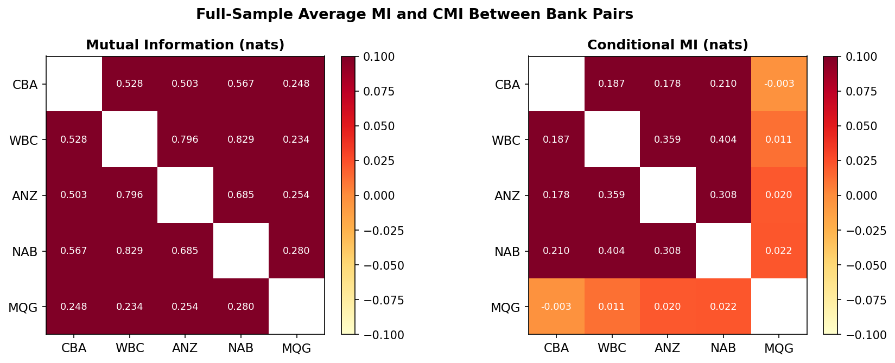
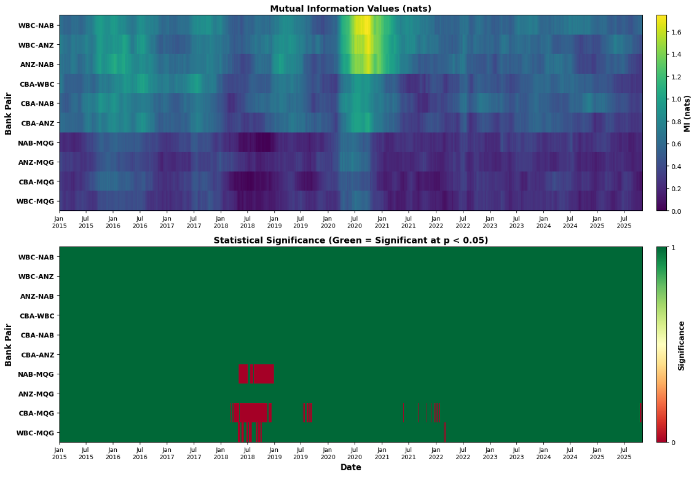
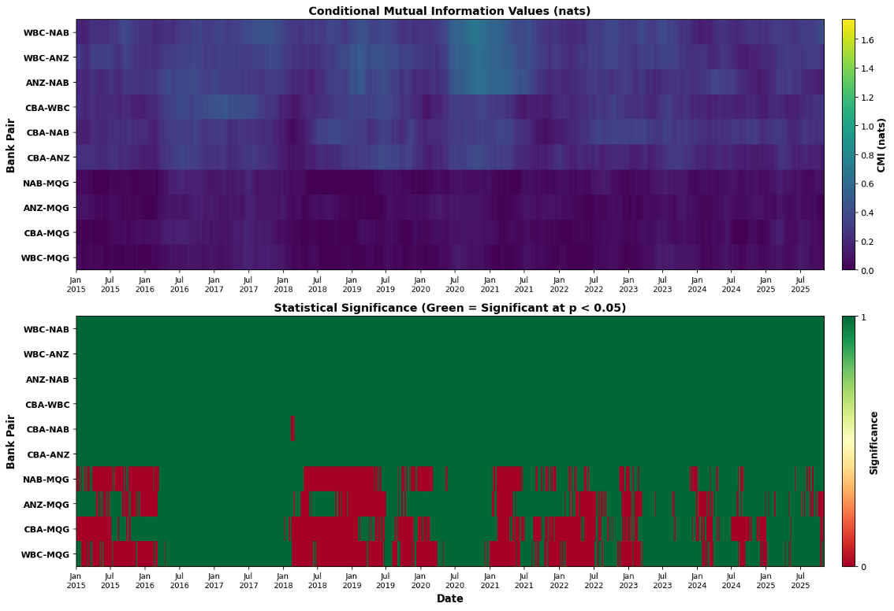
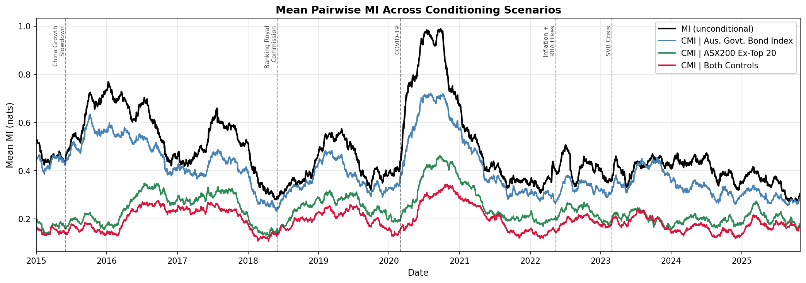
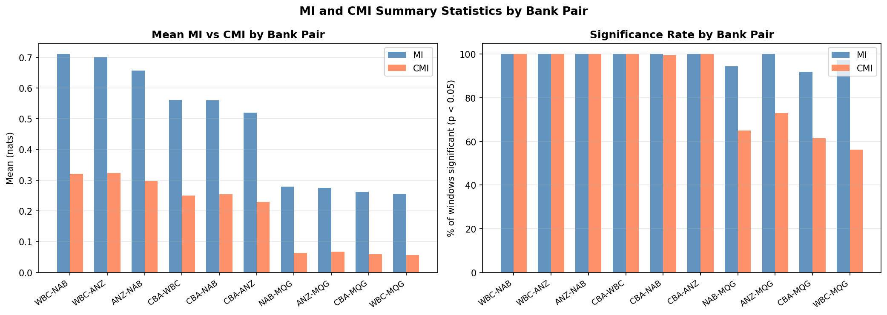

# Concentration of the Australian Equity Market in 5 Major Banks

An information-theoretic analysis of share price dependencies among Australia's five major banks using **Mutual Information (MI)** and **Conditional Mutual Information (CMI)**, computed over a rolling 10-year window using the KSG nearest-neighbour estimator.

📄 **[Download the full presentation (PDF)](Zhao_Daniel_Presentation_vF.pdf)**

---

## Table of Contents

1. [Motivation](#motivation)
2. [Research Question](#research-question)
3. [Data](#data)
4. [Method](#method)
5. [Results](#results)
   - [Full-Sample MI and CMI Matrices](#full-sample-mi-and-cmi-matrices)
   - [Mutual Information Over Time](#mutual-information-over-time)
   - [Conditional Mutual Information Over Time](#conditional-mutual-information-over-time)
   - [Effect of Conditioning](#effect-of-conditioning)
   - [Summary by Bank Pair](#summary-by-bank-pair)
6. [Conclusion](#conclusion)
7. [Repository Structure](#repository-structure)
8. [Getting Started](#getting-started)
9. [References](#references)

---

## Motivation

Australia's equity market is heavily concentrated in its banking sector. The five major banks collectively account for **25–30% of the ASX200 index** by market capitalisation (S&P Global, 2025), with Commonwealth Bank alone at ~11% — making it one of the most expensive banks in the world by P/E and P/B ratios.

| Bank | ASX Ticker | ~ASX200 Weight |
|---|---|---|
| Commonwealth Bank | CBA | ~11% |
| National Australia Bank | NAB | ~5% |
| Westpac | WBC | ~5% |
| ANZ | ANZ | ~4% |
| Macquarie Group | MQG | ~3% |

This concentration has direct implications for investors:

- **Index distortion** — if share prices move together, the five banks disproportionately drive ASX200 returns, volatility, and investor sentiment
- **Reduced diversification** — passive index investors (including superannuation funds and ETFs) gain less portfolio benefit from holding the index
- **Systemic risk** — correlated drawdowns amplify losses across the financial system simultaneously

Standard linear correlation captures some of this co-movement, but misses nonlinear tail dependencies that are particularly relevant during crisis periods — when banks are most likely to move together. This project uses mutual information to provide a distribution-free measure of dependence.

---

## Research Question

> **To what extent do dependencies exist among the stock price movements of Australia's major banks, and do these dependencies persist after conditioning on broader stock market and macroeconomic influences?**

The MI/CMI framework produces a natural three-way interpretation:

| Outcome | Interpretation | Implication |
|---|---|---|
| Low MI, Low CMI | Independent price dynamics | Diversification works; concentration not a concern |
| **High MI, Low CMI** | **Market/macro-driven co-movement** | **Systematic risk — common external forces dominate** |
| High MI, High CMI | Sector-specific structural linkages | Idiosyncratic/concentration risk — worst case |

---

## Data

- **Period:** August 2014 – October 2025 (10+ years, 2,887 rolling windows)
- **Source:** Yahoo Finance via the `yfinance` Python API
- **Price series:** Adjusted daily closing prices for 5 banks + 2 control variables
- **Preprocessing:** Daily log returns, z-score standardised (zero mean, unit variance)

**Control variables used for conditional MI:**

| Factor | Instrument | Ticker | Rationale |
|---|---|---|---|
| Broad market | Solactive ASX200 Ex-Top 20 Index | `DE000SL0CK81.SG` | Captures overall market trends while explicitly excluding the major banks — the best freely available proxy |
| Macroeconomic | Solactive Australia Government Bonds Index | `DE000SLA6QZ3.SG` | Bond yields reflect RBA rate expectations, inflation, and broader macro sentiment; updates continuously unlike underlying fundamentals |

---

## Method

MI and CMI are computed on a **150-day rolling window**, producing a time series of dependence estimates from late 2014 to 2025.

```
Raw prices  →  Log returns  →  Standardise  →  ACF analysis  →  Rolling KSG  →  MI / CMI time series
```

### Estimator: KSG (Kraskov-Stögbauer-Grassberger)

The **KSG1** nearest-neighbour estimator is used rather than a parametric (Gaussian) estimator because:
- Stock returns are heavy-tailed — the Gaussian assumption underestimates tail dependence
- KSG makes no distributional assumptions and captures nonlinear relationships
- It is consistent and asymptotically unbiased

**Parameters (chosen via robustness checks):**

| Parameter | Value | Notes |
|---|---|---|
| `k` (neighbours) | 4 | Tested k = 2, 4, 6, 8, 10 — results robust across values |
| Window size | 150 days | Tested 50–300 days — 150 balances smoothness and temporal resolution |
| Algorithm | KSG1 | Slightly more accurate than KSG2 for low-dimensional data |
| Noise | 1×10⁻⁸ | Added for numerical stability; negligible effect on estimates |

### Autocorrelation Control (Theiler Window)

To avoid inflating MI estimates via temporal autocorrelation in the nearest-neighbour search, the **Theiler window** (`DYN_CORR_EXCL` in JIDT) is set from ACF analysis of each return series. For these daily log returns, ACF analysis showed generally insignificant autocorrelation, so `DYN_CORR_EXCL = 0` was used.

### Statistical Significance

Statistical significance is assessed via **surrogate testing** (100 permutation surrogates per window). A time point is flagged as significant if the observed MI/CMI exceeds the 95th percentile of the surrogate null distribution (p < 0.05).

### Conditional MI

CMI is computed using JIDT's `ConditionalMutualInfoCalculatorMultiVariateKraskov1`, conditioning simultaneously on both control variables:

```
CMI(Bank_i ; Bank_j | ASX200 Ex-T20, Aus. Govt. Bond Index)
```

---

## Results

### Full-Sample MI and CMI Matrices

Averaging MI and CMI across all 2,887 windows gives the full-sample picture of pairwise dependence strength.



**Key observations:**
- The Big 4 retail banks (CBA, WBC, ANZ, NAB) show MI values of **0.50–0.83 nats**, indicating strong pairwise information sharing across the full sample
- WBC–NAB (0.83 nats) and WBC–ANZ (0.80 nats) are the most tightly coupled pairs
- Macquarie Group (MQG) shows substantially lower MI with all other banks (**0.23–0.28 nats**), reflecting its diversified business mix
- After conditioning, Big 4 CMI values fall to **0.18–0.40 nats** (~55% reduction), while MQG CMI values collapse to near zero (**0.01–0.06 nats**, ~77% reduction)

---

### Mutual Information Over Time

The heatmap below shows rolling 150-day MI for all 10 bank pairs, sorted by average MI. The lower panel shows statistical significance at p < 0.05 using 100 surrogates.



**Key observations:**
- **All Big 4 pairs are significant 100% of the time** — there is never a 150-day window in which their co-movement is indistinguishable from noise
- MI **spikes sharply during stress events** — particularly COVID-19 (March 2020) and the Inflation/RBA rate hike period (mid-2022), where inter-bank dependencies briefly exceed 1.5 nats
- The Banking Royal Commission (2018) also coincides with elevated MI across Big 4 pairs
- **MQG pairs show intermittent significance** — sustained periods (notably 2017–2019) where MQG's co-movement with other banks falls to statistically insignificant levels

---

### Conditional Mutual Information Over Time

CMI controls for broad market movements and macroeconomic factors. The same colour scale as the MI heatmap is used for direct visual comparison.



**Key observations:**
- CMI values are visibly darker across the board — confirming that a large portion of raw MI is explained by common external factors
- **Big 4 residual dependencies remain statistically significant** for nearly the entire sample, indicating sector-specific structural linkages beyond market/macro exposure
- **MQG CMI is predominantly statistically insignificant** (red in the significance panel), confirming that MQG's co-movement with other banks is almost entirely market/macro driven — consistent with its diversified investment banking and asset management model
- The stress-event MI spikes are substantially dampened in CMI, showing that crisis-period peaks in co-movement are largely attributable to shared market exposures rather than intrinsic bank-to-bank transmission

---

### Effect of Conditioning

This chart plots the mean pairwise MI (averaged across all 10 pairs) under each conditioning scenario.



**Key observations:**
- **Unconditional MI** (black) peaks near **1.0 nats** during COVID-19 and reaches local highs during every major stress event
- **Conditioning on the ASX200 Ex-Top 20** (green) achieves the largest reduction — broad equity market movements explain the most co-movement throughout the sample
- **Conditioning on bond yields** (blue) achieves a smaller but time-varying reduction — its effect is most pronounced during the 2022 RBA rate hiking cycle, where macro sensitivity was highest
- **Conditioning on both controls** (red) yields the lowest residual MI, ranging from roughly **0.1–0.4 nats**, but never collapses to zero — confirming persistent sector-specific dependencies among the Big 4

Controlling for both variables explains approximately **60% of raw MI** on average (0.478 nats → 0.192 nats).

---

### Summary by Bank Pair



The table below summarises mean MI, mean CMI, and significance rates across the full sample:

| Pair | Mean MI (nats) | Mean CMI (nats) | Reduction | MI Sig% | CMI Sig% |
|---|---|---|---|---|---|
| WBC–NAB | 0.710 | 0.321 | 54.8% | 100% | 100% |
| WBC–ANZ | 0.701 | 0.324 | 53.8% | 100% | 100% |
| ANZ–NAB | 0.657 | 0.297 | 54.9% | 100% | 100% |
| CBA–WBC | 0.562 | 0.250 | 55.5% | 100% | 100% |
| CBA–NAB | 0.561 | 0.255 | 54.6% | 100% | 99.5% |
| CBA–ANZ | 0.519 | 0.229 | 55.9% | 100% | 100% |
| NAB–MQG | 0.280 | 0.063 | 77.6% | 94.5% | 65.1% |
| ANZ–MQG | 0.275 | 0.067 | 75.6% | 100% | 72.9% |
| CBA–MQG | 0.262 | 0.059 | 77.5% | 91.9% | 61.4% |
| WBC–MQG | 0.256 | 0.056 | 78.2% | 97.4% | 56.1% |

The clear pattern: Big 4 pairs lose ~55% of MI after conditioning and remain highly significant. MQG pairs lose ~77% and become intermittently insignificant — their residual CMI is close to the noise floor.

---

## Conclusion

> **Share price dependence among Australia's major banks is primarily driven by common market and macroeconomic forces — consistent with the "moderate case" (High MI, Low CMI). However, significant residual sector-specific dependencies persist among the Big 4 retail banks even after controlling for these factors.**

Specific conclusions by bank:
- **WBC, ANZ, NAB** form the most tightly coupled group — structurally similar retail banks with the highest MI and the highest residual CMI after conditioning
- **CBA** shows somewhat weaker dependence with peers, consistent with its status as the largest and most stable institution attracting different investor behaviour
- **MQG** is the outlier — its co-movement is almost entirely explained by market/macro factors, consistent with its diversified investment banking and asset management model

**Limitations and future directions:**
- *Temporal resolution:* Daily data may miss intra-day dynamics. Higher-frequency data could reveal faster-moving dependencies
- *Proxy selection:* Two conditioning variables simplify macroeconomic complexity. Additional indicators (credit spreads, housing data, bank funding costs) could improve isolation of sector-specific effects
- *Directionality:* Transfer entropy or Granger causality methods could reveal which banks lead or lag in transmitting shocks — useful for identifying systemically important institutions

---

## Repository Structure

```
BankingSectorAnalysis/
├── Bank_Analysis_vF.ipynb              # Full analysis notebook
├── BankAnalysis.py                     # Standalone script version
├── Zhao_Daniel_Presentation_vF.pdf     # Presentation slides
│
├── plots/                              # Generated figures
│   ├── mi_heatmap.png                  # MI values + significance over time
│   ├── cmi_heatmap.png                 # CMI values + significance over time
│   ├── mi_conditioning_comparison.png  # Mean MI across conditioning scenarios
│   ├── mi_cmi_matrices.png             # Full-sample average MI and CMI matrices
│   └── mi_cmi_summary.png              # Mean MI/CMI and significance by pair
│
├── mi_time_series.csv                  # Pairwise MI — 150-day rolling (2887 × 10)
├── cmi_both_controls.csv               # CMI conditioned on both variables
├── cmi_interest_rates.csv              # CMI conditioned on bond index only
├── cmi_asx200.csv                      # CMI conditioned on ASX200 Ex-T20 only
├── mi_pvalues.csv                      # MI surrogate p-values (100 surrogates)
├── cmi_pvalues.csv                     # CMI surrogate p-values (100 surrogates)
├── bank_mi_matrix.csv                  # Full-sample average MI matrix (5×5)
└── bank_cmi_matrix.csv                 # Full-sample average CMI matrix (5×5)
```

---

## Getting Started

### Prerequisites

```bash
pip install numpy pandas matplotlib seaborn yfinance jpype1
```

You also need the **JIDT library** (`infodynamics.jar`). Download it from [github.com/jlizier/jidt/releases](https://github.com/jlizier/jidt/releases), then update the `jar_location` variable near the top of the notebook (or `JAR_LOCATION` in `BankAnalysis.py`).

### Running the analysis

Open `Bank_Analysis_vF.ipynb` in Jupyter and run all cells. The notebook has three sections:

1. **Data Processing** — downloads prices, computes log returns, performs ACF analysis
2. **Visualisations** — generates all MI/CMI heatmaps and time series plots
3. **Robustness Checks** — compares results across window sizes (50–300 days) and k-neighbour values (2–10)

Pre-computed results are saved as CSV files and can be loaded directly (using the "Load from CSV" cells) to skip the computation step, which takes approximately 30–60 minutes for the full surrogate testing pass.

---

## References

- Kraskov, A., Stögbauer, H., & Grassberger, P. (2004). Estimating mutual information. *Physical Review E, 69*(6), 066138.
- Lizier, J. T. (2014). JIDT: An information-theoretic toolkit for studying the dynamics of complex systems. *Frontiers in Robotics and AI, 1*, 11.
- Harre, M., & Bossomaier, T. (2009). Phase-transition-like behaviour of mutual information in financial markets. *Physical Review E, 79*(1), 016103.
- Kwon, O., & Yang, J.-S. (2008). Information flow between stock indices. *Europhysics Letters, 82*(6), 68003.
- Marschinski, R., & Kantz, H. (2002). Analysing the information flow between financial time series. *The European Physical Journal B, 30*(2), 275–281.
- Reserve Bank of Australia. (n.d.). *Cash rate target – statistical tables*. RBA Statistics.
- S&P Dow Jones Indices. (2025). *S&P/ASX 200: Index overview*. S&P Global.
- Senate Economics References Committee. (2011). *Competition within the Australian banking sector* (Chapter 9: Four Pillars Policy). Parliament of Australia.
